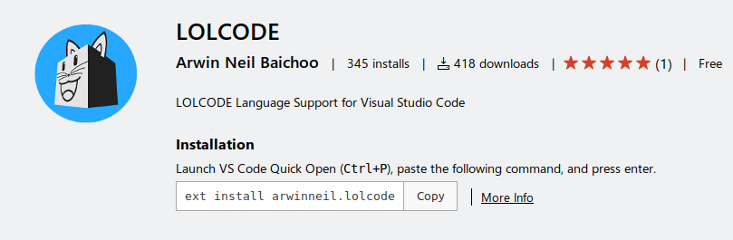

# Aprende un lenguaje de programación en un día (ejercicio voluntario para subir nota).

## Introducción

Cuando te sacaste el carnet de conducir, aprendiste las normas de circulación así como los fundamentos básicos para manejar un coche: volante, marchas, freno, acelerador, embrague, retrovisores... Seguramente, el coche que conduces ahora es diferente al que utilizaste para aprender a conducir, no obstante, lo puedes llevar sin problema. Cada coche tiene sus peculiaridades, pero quien sabe manejar un automóvil, puede adaptarse a las medidas, tacto y comportamiento de un vehículo en cuestión de horas.

Aprender a programar es como aprender a conducir. Si tienes una base sólida de programación y sabes manejar con soltura los tipos de datos, bucles, arrays, clases, métodos, etc. podrás pasar de un lenguaje a otro en un período relativamente corto, simplemente tendrás que adaptarte a la sintaxis y a las peculiaridades del nuevo lenguaje.

Con este ejercicio se pretende despertar el interés por otros lenguajes de programación distintos al que el alumno está estudiando como primer lenguaje.

Sigue los pasos que se indican a continuación.

## Creación del equipo

Este ejercicio se debe hacer en grupos de 3 alumnos. Uno de ellos será el representante del grupo.

## Forkea forkea

El representante del grupo debe hacer un *fork* de este repositorio para utilizarlo como base.

## Añadiendo colaboradores

El encargado del grupo deberá añadir como colaboradores del repositorio *forkeado* a los otros dos miembros, para trabajar todos sobre los mismos archivos. Cuando alguien es colaborador en un repositorio, puede hacer *push* a él sin necesidad de pedir permiso o hacer *pull request*.

Para añadir colaboradores hay que hacer click en la pestaña *Settings* y seleccionar luego *Collaborators* en el menú.

## Miembros del grupo

Escribe aquí los miembros del grupo. El primero es el representante o encargado.

* [Fernando Leiva Brenes](https://github.com/FernandoLeivaBrenes "Perfil de GitHub de Fernando Leiva Brenes")
* [Julian Pérez Ortiz](https://github.com/JulianPerezOrtiz "Perfil de GitHub de Julian Pérez Ortiz")
* [Miguel Solís La Beira](https://github.com/MiguelSolisLaBeira "Perfil de GitHub de Miguel Solis La Beira")

## Lenguaje de programación

El profesor llevará una cajita llena de papelitos con los nombres de distintos lenguajes de programación. Los encargados de cada grupo meterán la mano en la caja y sacarán dos papelitos, de los cuales el grupo elegirá uno. No se permite hacer intercambio de papelitos entre grupos.

Escribe el lenguaje de programación elegido por el grupo.

### [**LOLCODE**](https://es.wikipedia.org/wiki/LOLCODE "Wikipedia/LOLCODE"):
[](https://es.wikipedia.org/wiki/LOLCODE "Wikipedia/LOLCODE")

Los papelitos se han recortado de este [documento](lenguajes_de_programacion.pdf).

## Información sobre el lenguaje

[**LOLCODE**](https://es.wikipedia.org/wiki/LOLCODE "Wikipedia/LOLCODE") es un lenguaje de programación esotérico inspirado en el fenómeno de Internet de los Lolcat. Fue creado el 2007 por Adam Lindsay, investigador del Departamento de Computación de la Universidad de Lancaster.

> Un lolcat es la combinación de la fotografía de un gato con un texto humorístico y en inglés macarrónico sobre la idiosincrasia del gato.

Las palabras clave del lenguaje LOLCODE son abreviaturas bien comprimidas del lenguaje utilizado por las imágenes de los Lolcat.

##### Por ejemplo :

|**Sintaxis**|**Representación**|**Relación en nuestra lengua**|
|:-----------:|:----------:|:---------:|
|OMGWTF||Podemos entenderlo como el *default* dentro del *switch*|
|O RLY||Por otro lado esta sería la definición del *If*|
|CANHAS||El codigo *CAN HAS ?* se entiende como la importación de una librería, en la versión 1.4 sería posible con las siguientes : **STDIO, STRING, SOCKS y STDLIB.**|

En general estos lenguajes poseen una sintaxis muy básica, con un alfabeto muy restringido, lo que los hace especialmente peculiares en su implementación. En su creación muchas veces ha primado la diversión por parte de los desarrolladores, sobre la utilidad.
El interprete de este lenguaje está desarrollaod en C y es conocido como Ici.

## Herramientas de desarrollo

Podemos programar en Lolcode online en la web [**www.repl.it.**](https://repl.it/ "https://repl.it/")

También disponemos de un plugin para el Visual Studio Code en su propio marketplace.
[](https://marketplace.visualstudio.com/items?itemName=arwinneil.lolcode "Extension/LOLCODE")

O también en esta web: [*https://packagecontrol.io/packages/LOLCODE*](https://packagecontrol.io/packages/LOLCODE "packages/LOLCODE") podemos descargar el plugin para **SublimeText**.

Documentación genérica en [**TUTORIALSPOINT**](https://www.tutorialspoint.com/lolcode/index.htm "TutorialsPoint - LOLCODE")
Dentro de esta página tambien ppodemos encontrar un IDE online.

## Poniendo en práctica el lenguaje

Pon en práctica el lenguaje de programación realizando los siguientes ejercicios. Para cada uno de los ejercicios, pega el código fuente de la solución y una captura de pantalla.

### 1. ¡Hola mundo!

Realiza un programa que muestre por pantalla la frase **¡Hola mundo!**.

```lolcode
HAI 1.2
  BTW Programa HolaMundo
  VISIBLE Hola Mundo
KTHXBYE
```

### 2. Pirámide

Dada una altura introducida por el usuario, realiza un programa que pinte una pirámide a base de asteriscos con la altura indicada.

```lolcode
HAI 1.2
BTW Programa Hola Mundo 
I HAS A ALTURA ITZ 0
ALTURA IS NOW A NUMBR
VISIBLE "Introduce la altura de la piramide"
GIMMEH ALTURA

I HAS A PINTADA ITZ 0
PINTADA R ALTURA
I HAS A ESPACIO ITZ "" 
ESPACIO IS NOW A YARN
I HAS A PASADA ITZ 1
I HAS A MITAD ITZ 0
MITAD R ALTURA

I HAS A RELLENO ITZ "*"
RELLENO IS NOW A YARN

I HAS A PIRAMIDE ITZ 0
IM IN YR LOOP NERFIN YR PINTADA WILE DIFFRINT  PINTADA AN 0

IM IN YR LOOP NERFIN YR MITAD TIL BOTH SAEM MITAD AN 0
VISIBLE SMOOSH ESPACIO AN " " MKAY!
IM OUTTA YR LOOP

IM IN YR LOOP UPPIN YR PIRAMIDE TIL BOTH SAEM PIRAMIDE AN PASADA 
VISIBLE SMOOSH RELLENO AN " " MKAY!
IM OUTTA YR LOOP

VISIBLE 
PIRAMIDE R 0
MITAD R ALTURA
MITAD R DIFF OF MITAD AN PASADA
PASADA R SUM OF PASADA AN 1

IM OUTTA YR LOOP

KTHXBYE
```

### 3. Arrays y números aleatorios

Realiza un programa que rellene un array (o una estructura similar) con 20 números enteros aleatorios entre 1 y 100 y que seguidamente los muestre por pantalla. A continuación, se deben pasar los números primos a las primeras posiciones del array y los no primos a las posiciones restantes. Muestra finalmente el array resultado.

## Presentación de resultados

Cada equipo explicará al resto de la clase lo aprendido durante la realización del ejercicio. Todos los miembros de cada equipo deben participar en la explicación. Se puede utilizar como material de base para la presentación el repositorio de GitHub.

## Recompensa

* Todos los alumnos que realicen correctamente la actividad tendrán 0'25 puntos extra en la nota del trimestre.

* Los miembros del equipo más votado ganarán un premio.

:star: Si te ha gustado este ejercicio, dale una estrellita al [repositorio original](https://github.com/LuisJoseSanchez/aprende-un-lenguaje-en-un-dia).
